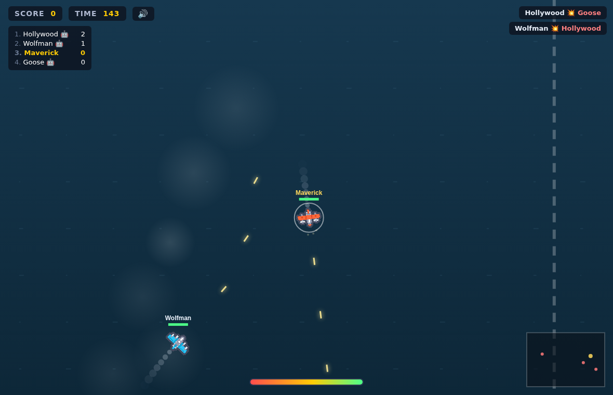

# 🛩️ SmashCart

Online, **3D plane combat arena** — fly, shoot, and smash everyone out of the sky in
a bright **arcade-cute** toy world. Built to be instantly playable and easy to share
with friends: click **Quick Play** and you're dogfighting in seconds, or spin up a
private room and send the link. Empty slots are filled with AI bots so a match is
never empty.

Authoritative **Colyseus** multiplayer server (2D-plane simulation) + a **Three.js**
3D client, designed to be self-hosted on your own VPS — no CDNs, everything vendored.



## Features

- **Real-time online multiplayer** — server-authoritative simulation at 30 Hz with
  client-side smoothing/interpolation.
- **Quick Play + private rooms** — `?room=CODE` share links; bots auto-fill to keep
  the arena lively.
- **Fast, one-axis controls** — auto-thrust; you steer, boost, and fire. Anyone gets
  it in five seconds.
- **Plays on phones** — on-screen FIRE/BOOST buttons plus **gyro tilt-to-steer**
  (tilt your phone to bank), with a tap-to-recenter button. Falls back to on-screen
  arrows if you turn gyro off.
- **Arcade-cute 3D** — rounded low-poly toy planes (banking, spinning props) over a
  toy-island arena (grass, water, blimp, balloons, clouds), with soft/blob shadows,
  bloom, and a speed-sensing chase camera.
- **Juice** — boost smoke + flames, bullet tracers, poofy explosions (shockwave ring +
  sparkles + smoke), screen shake, hit-stop, kill feed, floating "+1 SMASH!" popups,
  combo / kill-streak callouts, damage vignette, low-health pulse, and a minimap.
- **Sampled audio** — looping music, engine, gunfire, explosions, kill jingle, and UI
  sounds (self-hosted WAVs in `public/assets/audio/`), with a master/music/sfx mixer,
  mute, and a synth fallback if a sample fails to load.
- **Quality settings** — Low/Med/High tiers (pixel-ratio, bloom, shadows, particles)
  with automatic FPS-based downscaling, so it stays smooth on mid-range phones.
- **Self-hosted / CC0** — geometry is procedural; audio is generated-original (CC0);
  legacy Kenney *Pixel Shmup* sprites remain in-repo (CC0).

## Controls

**Desktop**

| Action | Keys |
| ------ | ---- |
| Steer  | `A` / `D` or `◀` / `▶` |
| Boost  | `W` / `Shift` |
| Fire   | `Space` |
| Pause  | `P` |
| Mute   | `M` |

**Mobile** — on-screen **FIRE** and **BOOST** buttons. Steering is **gyro tilt** by
default (tilt the phone left/right; tap **⟳** to recenter neutral). Uncheck *"Tilt to
steer"* on the start screen to use on-screen **◀ ▶** arrows instead. iOS prompts for
motion permission on first start.

## Tech stack

- **Server:** Node.js + [Colyseus](https://colyseus.io) `0.16` (`@colyseus/schema` v3),
  Express for static hosting, TypeScript.
- **Client:** vanilla JS + [Three.js](https://threejs.org) (WebGL) with EffectComposer
  bloom. Three.js, its post-processing addons, and the Colyseus browser client are all
  vendored under `public/vendor/` (no CDN needed) and loaded via an import map.

> **Version note:** the stack is pinned to the **Colyseus 0.16 line** because the
> published browser client (`colyseus.js@0.16.x`) ships schema **v3**, while server
> core `0.17` requires schema **v4** — mixing them breaks state decoding in the
> browser. Keep server and client on the same major line.

## Local development

```bash
npm install          # install deps + vendor the browser client
npm run dev          # tsx watch — http://localhost:2567
```

Open http://localhost:2567 in two tabs to test multiplayer. The Colyseus monitor is
at http://localhost:2567/colyseus (lock this down in production).

## Production build

```bash
npm run build        # tsc -> dist/
npm start            # node dist/index.js
```

## Deploying to your VPS

### Option A — Docker (recommended)

```bash
docker compose up -d --build
# app on :2567 — put nginx in front for TLS (see deploy/nginx.conf.example)
```

### Option B — systemd

```bash
git clone <repo> /opt/smashcart && cd /opt/smashcart
npm ci && npm run build
sudo cp deploy/smashcart.service /etc/systemd/system/
sudo systemctl daemon-reload && sudo systemctl enable --now smashcart
```

Then reverse-proxy with nginx (WebSocket upgrade headers are **required** for
Colyseus — see [`deploy/nginx.conf.example`](deploy/nginx.conf.example)) and add TLS
with certbot.

## Project layout

```
src/                       Colyseus server (TypeScript)
  index.ts                 bootstrap: serves client + WebSocket, defines room
  rooms/ArenaRoom.ts       authoritative game loop, physics, bots, scoring
  schema/ArenaState.ts     synchronized state (players, bullets, timer)
  shared/constants.ts      gameplay tuning
public/                    static client (served by the server)
  index.html, css/, js/    UI + 3D client (constants/quality/audio/input/net/render3d/main)
  vendor/                  vendored colyseus.js + three.module.min.js + jsm post-FX addons
  assets/audio/            generated-original WAV SFX + music (see scripts/gen-audio.mjs)
  assets/planes, tiles/    legacy Kenney Pixel Shmup sprites (CC0)
scripts/                   vendor-three-addons.mjs, gen-audio.mjs (build helpers)
deploy/                    systemd unit + nginx example
Dockerfile, docker-compose.yml
```

## Tuning

Gameplay values live in `src/shared/constants.ts` (server, authoritative) mirrored in
`public/js/constants.js` (client prediction/rendering). Edit speeds, damage, round
length, arena size, bot count, etc. — **keep the two files in sync.**

## Credits

- 3D engine: [Three.js](https://threejs.org) (MIT) — vendored, incl. EffectComposer/
  UnrealBloomPass post-processing addons.
- Multiplayer framework: [Colyseus](https://colyseus.io).
- Audio: **generated-original** arcade SFX + music (CC0), produced by
  `scripts/gen-audio.mjs`. Drop-in replaceable with Kenney CC0 packs using the same
  filenames in `public/assets/audio/`.
- Legacy sprites: **"Pixel Shmup" by Kenney** — [kenney.nl](https://kenney.nl),
  CC0 1.0 (public domain). See `public/assets/CREDITS.txt`. (Now superseded by the
  procedural 3D planes; kept in-repo.)

## License

MIT (code). Bundled audio is generated-original CC0; legacy art is CC0.
